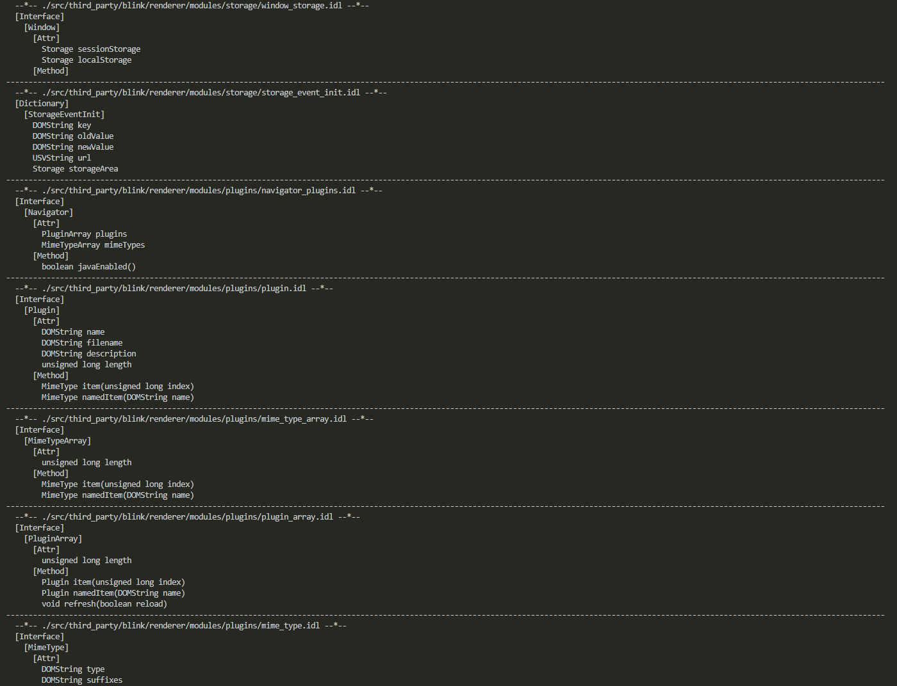

### IDLParserTool
所有代码都是从Chromium项目中copy出来的，做了一点小改动封装成了一个module。

#### Example

```python
#!/usr/bin/env python3.8

import os

from IDLParserTool.idl_reader import IdlReader

def find_all_files_by_suffix(target_dir:str, suffix:str):
    result = []
    for path, _, files in os.walk(target_dir):
        for file in files:
            if file.endswith(suffix):
                result.append(os.path.join(path, file))
    return result

if __name__ == '__main__':
    reader = IdlReader(outputdir="./out")
    idl_files_dir = './src/third_party/blink/renderer/modules'
    for file in find_all_files_by_suffix(idl_files_dir, '.idl'):
        result = reader.read_idl_file(file)
        
        print('-'*196)
        print(f"  --*-- {file} --*--")
        if result.dictionaries:
            print("  [Dictionary]")
            for key in result.dictionaries.keys():
                item = result.dictionaries[key]
                print(f"    [{key}]")
                for member in item.members:
                    print(f"      {member.idl_type} {member.name}")
        
        if result.interfaces:
            print("  [Interface]")
            for key in result.interfaces.keys():
                interface = result.interfaces[key]
                print(f"    [{key}]")
                print(f"      [Attr]")
                for attr in interface.attributes:
                    print(f"        {attr.idl_type} {attr.name}")
                print(f"      [Method]")
                for method in interface.operations:
                    args = []
                    for arg in method.arguments:
                        args.append(f"{arg.idl_type} {arg.name}")
                    args_pass = ', '.join(args)
                    print(f"        {method.idl_type} {method.name}({args_pass})")
```

